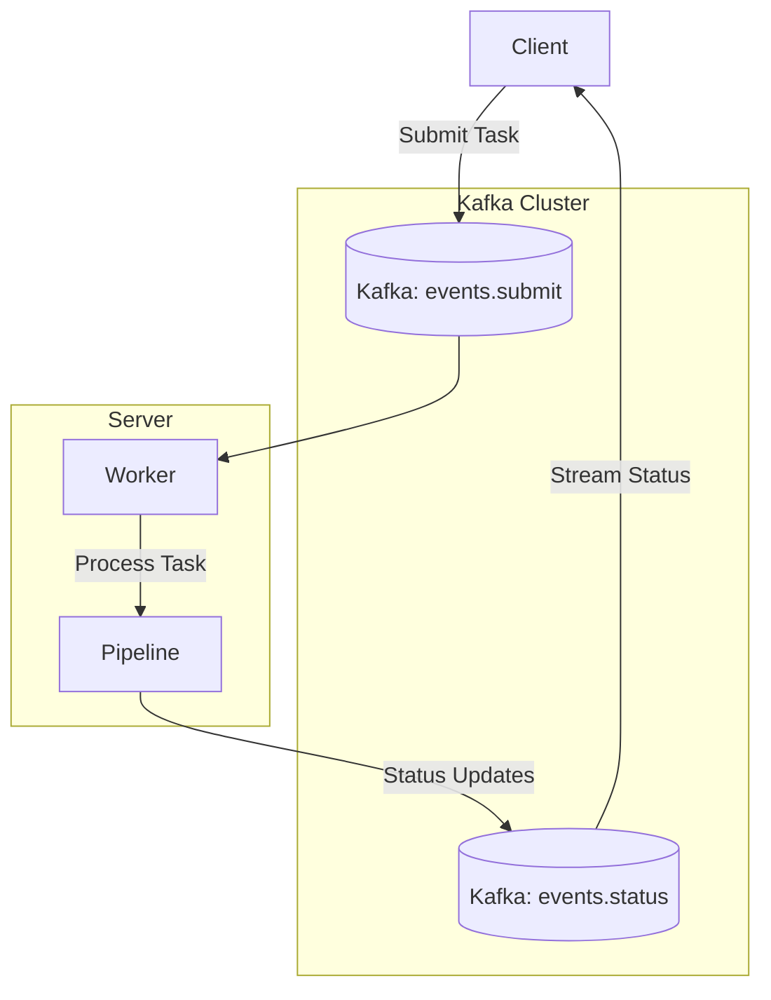

# AsynK

A distributed task scheduling library for `golang` using **Apache Kafka**. AsynK provides a reliable way to distribute and process asynchronous tasks across multiple workers with real-time status updates.

[](https://golang.org/doc/go1.23)
[](LICENSE)

## Overview

AsynK leverages Apache Kafka's distributed messaging capabilities to create a robust task scheduling and processing system. It provides:

- Task submission with unique identification
- Real-time status updates and progress tracking
- Distributed worker processing
- Configurable performance presets
- Reliable error handling and recovery

## Key Features

- **Distributed Task Processing**: Scale your tasks across multiple workers and machines
- **Real-time Status Updates**: Stream task status and progress in real-time
- **Configurable Performance Modes**: Choose from preset configurations optimized for different workloads:
  - Low-latency: For immediate task processing
  - High-throughput: For processing large volumes of tasks
  - Reliable: For guaranteed task delivery
  - Balanced: Default configuration balancing reliability and performance
- **Robust Error Handling**: Built-in error recovery and retry mechanisms
- **Structured Logging**: Comprehensive logging system with multiple log levels
- **Dev Environment**: Includes a fully configured development environment with Kafka

## Architecture

AsynK follows a client-server architecture pattern where:

1. **Clients** submit tasks to Kafka topics
2. **Workers** consume tasks, process them, and report status
3. **Status Updates** are streamed back to clients in real-time



## Component Description

- **Client**: Submits tasks and listens for status updates
- **Server**: Manages workers processing submitted tasks
- **Pipeline**: Handles task processing and status updates
- **Worker**: Processes tasks from Kafka and returns results
- **Kafka Topics**:
  - `events.submit`: Queue for new task submissions
  - `events.status`: Stream of task status updates

## Getting Started

### Prerequisites

- Go 1.23 or later

### Installation

Add AsynK to your Go project:

```bash
go get github.com/mwantia/asynk
```

## Usage Examples

### Creating a Worker

```go
package main

import (
	"context"
	"log"
	"os"
	"os/signal"

	"github.com/mwantia/asynk/pkg/options"
	"github.com/mwantia/asynk/pkg/server"
)

func main() {
	ctx, cancel := signal.NotifyContext(context.Background(), os.Interrupt)
	defer cancel()

	// Create a new server with Kafka connection
	srv, err := server.NewServer(
		options.WithBrokers("kafka:9092"),
		options.WithPool("myapp"),
		options.WithGroupID("worker-group"),
	)
	if err != nil {
		panic(err)
	}

	// Create a serve mux to route tasks
	mux := server.NewServeMux()
	
	// Register handlers for different task types
	mux.HandleFunc("email", HandleEmailTask)
	mux.HandleFunc("report", HandleReportTask)

	// Start serving
	if err := srv.ServeMutex(ctx, mux); err != nil {
		if ctx.Err() == nil {
			log.Fatalf("Server error: %v", err)
		}
	}
}

func HandleEmailTask(ctx context.Context, p *server.Pipeline) error {
	// Process email task and update status
	// ...
	return nil
}

func HandleReportTask(ctx context.Context, p *server.Pipeline) error {
	// Process report task and update status
	// ...
	return nil
}
```

### Submitting Tasks

```go
package main

import (
	"context"
	"encoding/json"
	"fmt"
	"log"

	"github.com/mwantia/asynk/pkg/client"
	"github.com/mwantia/asynk/pkg/event"
	"github.com/mwantia/asynk/pkg/options"
)

type EmailTask struct {
	To      string `json:"to"`
	Subject string `json:"subject"`
	Body    string `json:"body"`
}

func main() {
	// Create a client for submitting email tasks
	c, err := client.NewClient("email",
		options.WithBrokers("kafka:9092"),
		options.WithPool("myapp"),
		// Use preset for immediate processing
		options.WithPreset(options.PresetLowLatency),
	)
	if err != nil {
		log.Fatalf("Failed to create client: %v", err)
	}
	defer c.Close()

	// Prepare task data
	task := EmailTask{
		To:      "user@example.com",
		Subject: "Task Example",
		Body:    "This is a test task",
	}

	payload, err := json.Marshal(task)
	if err != nil {
		log.Fatalf("Failed to marshal task: %v", err)
	}

	// Submit the task
	streams, err := c.Submit(context.Background(), event.SubmitEvent{
		ID:      event.UUIDv7(),
		Payload: payload,
	})
	if err != nil {
		log.Fatalf("Failed to submit task: %v", err)
	}

	// Process status updates in real-time
	for status := range streams {
		fmt.Printf("Task status: %s\n", status.Status)
		
		// Task is done when we reach a terminal status
		if status.Status.IsTerminal() {
			break
		}
	}
}
```

## Performance Tuning

AsynK comes with pre-configured performance profiles in `pkg/options/preset.go`:

```go
// Create a high-throughput client for batch processing
client, err := client.NewClient("batch-processing",
    options.WithBrokers("kafka:9092"),
    options.WithPreset(options.PresetHighThroughput),
)

// Create a reliable client for critical tasks
client, err := client.NewClient("critical-tasks",
    options.WithBrokers("kafka:9092"),
    options.WithPreset(options.PresetReliable),
)
```

## Running Example Tasks

The repository includes examples that can be run using the Task CLI:

```bash
# Run the worker example
task worker

# Run the streaming client example
task streamer
```

## License

This project is licensed under the Apache License 2.0 - see the [LICENSE](LICENSE) file for details.